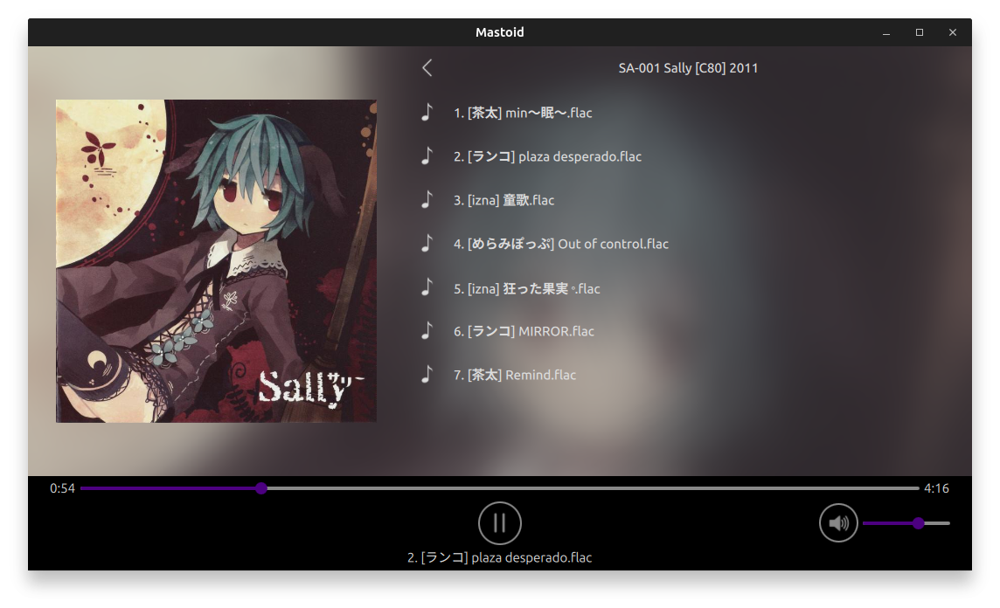

# Mastoid

<div align="center">


Mastoid is an open source file based music player.

There is no accounts, no subscriptions, no need for internet access, no complex app specific abstractions... Just organize your files in a decent hierarchical layout and enjoy.



</div>

## To do

- music player
    - implement playlists
- spectrum viewer ?

## Dependencies

This application is built with Qt6, specifically:

- QtCore
- QtQuick
- QtWidgets
- QtDBus

## Configuration

An example config file with detailed explanations is provided in this repo as well as a GUI editor that you can access through the button on the left of the player controls.
The config file must be placed in the OS specific configuration directory which should be the following:

| OS | Configuration Directory |
| --- | --- |
| Linux | `~/.config/Mastoid` |
| Windows | `C:/Users/<USER>/AppData/Local/Mastoid` |

## Build

Preferably, install Qt Creator and open the `CMakeLists.txt` and build it from there. That's the easiest way.

For the shaders, notice how there are the `.frag` and `.vert` files which contain the glsl shaders but there are also some `.qsb` files. Those are "Qt shader baker" files.

Basically with Qt 6, they decided that rather than putting the shaders in a string along with the qml files, shaders should instead be written inside shader files and then a program called qsb must "bake" thes into qsb files which are files that contain different versions of the shader for different APIs. The qsb file are the ones that are loaded by the Qt quick app.

I'm sure that helps with portability but it increases the build complexity because now you need the qsb program in your build chain.

To bake the shader, I used the qsb program like this:

```
qsb --glsl 100es,120,150 --hlsl 50 --msl 12 -o background.vert.qsb background.vert
qsb --glsl 100es,120,150 --hlsl 50 --msl 12 -o background.frag.qsb background.frag
```

qsb should be shipped with your Qt installation. I found it in `~/Qt/<qt_version 6.x.x>/<compiler (gcc_64)>/bin/qsb`

It should be possible to integrate this with cmake but I've read it's buggy. I'll check this out later and hopefully automate this in the future.

For now and to make things simpler if someone just wants to compile and run this app, I have put the baked shaders in this repo. If you want to mess with the shader, you will have to mess with qsb.

## License

GNU General Public License v3.0

