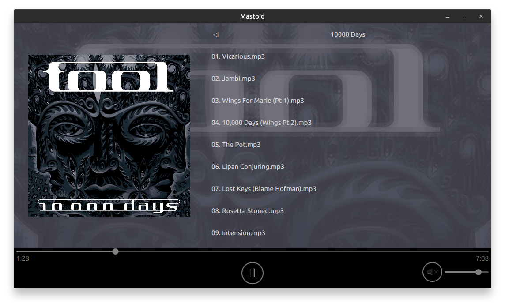

# Mastoid

<div align="center">


Mastoid is an open source file based music player.

There is no accounts, no subscriptions, no need for internet access, no complex app specific abstractions... Just organize your files in a decent hierarchical layout and enjoy.



</div>

## To do

- Settings menu: needs more work
- Spectrum viewer: finally here but needs more work on the visuals

## Dependencies

This application is built with Qt6, specifically:

- QtCore
- QtQuick
- QtWidgets
- QtDBus

You will also need the FFTW library, specifically the float and float threaded components.

## Configuration

An example config file with detailed explanations is provided in this repo as well as a GUI editor that you can access through the button on the left of the player controls.
The config file must be placed in the OS specific configuration directory which should be the following:

| OS | Configuration Directory |
| --- | --- |
| Linux | `~/.config/Mastoid` |
| Windows | `C:/Users/<USER>/AppData/Local/Mastoid` |

## Build

Use the `CMakeLists.txt` either in your IDE, or by running

```bash
mkdir build
cd build
cmake ..
make # depending on your build system
```

Just make sure you have the Qt specific build tools like the MOC and RCC. You also need the Qt Shader Tools module.

## License

GNU General Public License v3.0

